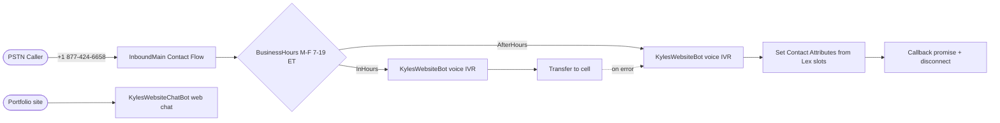

# terraform-aws-connect-callcenter

Free-tier-friendly Amazon Connect call center deployed via Terraform. Built incrementally so each layer can be verified in the AWS Console before the next is stacked.

**Live demo**: `+1 877-424-6658` (toll-free) — M-F 7am–7pm ET transfers to my cell after a brief Lex IVR. After hours, **KylesWebsiteBot** collects name/phone/message and disconnects with a callback promise.

## Architecture



Connect module: [`aws-ia/amazonconnect/aws ~> 0.0.1`](https://github.com/aws-ia/terraform-aws-amazonconnect). Dual providers: `hashicorp/aws` + `hashicorp/awscc` (Lex V2 resource policy only).

## Live identifiers

| Resource | Identifier |
|---|---|
| Connect instance | `kwade-callcenter-demo` (`6ea4190b-3cd7-43ee-90d6-559cb25059dd`) |
| CCP | https://kwade-callcenter-demo.my.connect.aws/ccp-v2/ |
| Toll-free | +1 877-424-6658 |
| Voice Lex bot | `KylesWebsiteBot` (alias `TestBotAlias`, ID `YPUBHWXZVM`) |
| Web chat Lex bot | `KylesWebsiteChatBot` (`terraform output lex_bot_id`) |
| Contact flow | `InboundMain` |
| Web chat auth | Cognito identity pool → `lex:*` on chat bot alias only |

## Repo layout

```
.
├── main.tf, cognito.tf, variables.tf, outputs.tf
├── flows/inbound_main.json   # console-exported flow, content-hashed for drift detection
└── terraform.tfvars.example
```

## Setup (clean account)

```bash
aws sso login --profile KyleHamwey   # or your profile
cp terraform.tfvars.example terraform.tfvars
terraform init && terraform plan -out tfplan && terraform apply tfplan
```

**Cleanup note**: Connect won't delete queues/hours/security profiles via API — `terraform state rm` those resources before `terraform destroy`. Release phone numbers in Console first.

## Roadmap

- [ ] **Lambda + SES (in progress)**: `aws_connect_lambda_function_association` + handler to read after-hours Contact Attributes (`caller_name`, `caller_phone`, `caller_message` from Lex slots) and send email via SES
- [x] **Portfolio web chat**: Cognito identity pool, `KylesWebsiteChatBot`, Terraform outputs → Amplify env vars → LexChat widget live on [React-Portfolio](https://github.com/KHamwey/React-Portfolio)
- [ ] **CI/CD**: GitHub Actions — `terraform plan` on PR, apply on merge, OIDC auth
- [ ] **Remote state**: S3 + DynamoDB lock table
- [ ] **Slot-driven branching**: intent-based routing (e.g. `ProvideResume` → SNS)
- [ ] **Contact Lens**: transcription + sentiment → CloudWatch metrics

## License

MIT
