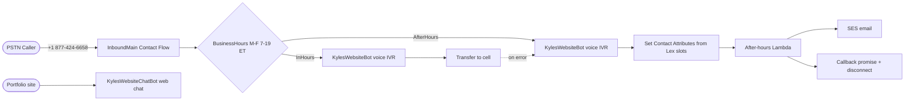

# terraform-aws-connect-callcenter

Free-tier-friendly Amazon Connect call center deployed via Terraform. Built incrementally so each layer can be verified in the AWS Console before the next is stacked.

**Live demo**: `+1 877-424-6658` (toll-free) — M-F 7am–7pm ET transfers to my cell after a brief Lex IVR. After hours, **KylesWebsiteBot** collects name/phone/message, emails the details via Lambda + SES, then disconnects with a callback promise.

## Architecture



Connect module: [`aws-ia/amazonconnect/aws ~> 0.0.1`](https://github.com/aws-ia/terraform-aws-amazonconnect). Dual providers: `hashicorp/aws` + `hashicorp/awscc` (Lex V2 resource policy only).

## Live identifiers

| Resource | Identifier |
|---|---|
| Connect instance | `kwade-callcenter-demo` (`6ea4190b-3cd7-43ee-90d6-559cb25059dd`) |
| CCP | https://kwade-callcenter-demo.my.connect.aws/ccp-v2/ |
| Toll-free | +1 877-424-6658 |
| Voice Lex bot | `KylesWebsiteBot` (alias `TestBotAlias`, ID `YPUBHWXZVM`) |
| Web chat Lex bot | `KylesWebsiteChatBot` (`terraform output lex_bot_id`) |
| Contact flow | `InboundMain` |
| Web chat auth | Cognito identity pool → `lex:*` on chat bot alias only |

## Repo layout

```
.
├── main.tf, cognito.tf, lambda.tf, variables.tf, outputs.tf
├── lambda/after_hours_notifier.js
├── .github/workflows/terraform.yml
├── terraform-state-bootstrap/    # one-time: S3 state, DynamoDB lock, GitHub OIDC role
├── backend.hcl.example
├── flows/inbound_main.json.tpl   # Lambda ARN injected at apply time
└── terraform.tfvars.example
```

## Setup (local)

```bash
aws sso login --profile KyleHamwey
cp terraform.tfvars.example terraform.tfvars
# After CI/CD bootstrap (see below):
cp backend.hcl.example backend.hcl
terraform init -backend-config=backend.hcl
terraform plan -out tfplan && terraform apply tfplan
```

**Cleanup note**: Connect won't delete queues/hours/security profiles via API — `terraform state rm` those resources before `terraform destroy`. Release phone numbers in Console first.

**SES note**: If your account is in the SES sandbox, verify both `ses_from_email` and `notification_email` (Terraform creates identities; click the verification links in your inbox).

## CI/CD (GitHub Actions + OIDC)

Remote state and GitHub OIDC are bootstrapped once from `terraform-state-bootstrap/` (local state — chicken-and-egg).

### 1. Bootstrap (one-time, local)

```bash
cd terraform-state-bootstrap
cp terraform.tfvars.example terraform.tfvars
terraform init && terraform apply
```

Note the outputs: `state_bucket_name`, `lock_table_name`, `github_actions_role_arn`.

If OIDC provider already exists in the account: set `create_github_oidc_provider = false` in `terraform.tfvars`.

### 2. Migrate root module to remote state

```bash
cd ..
cp backend.hcl.example backend.hcl   # fill from bootstrap outputs if needed
terraform init -backend-config=backend.hcl -migrate-state
```

Confirm migration when prompted. Local `terraform.tfstate` moves to S3.

### 3. GitHub repository settings

**Secrets** (Settings → Secrets and variables → Actions):

| Secret | Value |
|---|---|
| `AWS_ROLE_ARN` | `terraform output -raw github_actions_role_arn` from bootstrap |
| `TF_VAR_agent_password` | Same as local `terraform.tfvars` |

**Variables** (repository variables):

| Variable | Value |
|---|---|
| `TF_STATE_BUCKET` | e.g. `kwade-callcenter-demo-tfstate-528757806846` |
| `TF_LOCK_TABLE` | e.g. `kwade-callcenter-demo-tflock` |

Non-secret `TF_VAR_*` values are set in [`.github/workflows/terraform.yml`](.github/workflows/terraform.yml).

### 4. Workflow behavior

- **Pull requests to `main`**: `fmt` → `validate` → `plan` (comment on PR)
- **Push to `main`**: same, then `apply` with the saved plan
- Auth via **OIDC** — no long-lived AWS access keys in GitHub

## Roadmap

- [x] **Lambda + SES**: after-hours Contact Attributes emailed via Lambda + SES
- [x] **Portfolio web chat**: Cognito + Amplify LexChat widget
- [x] **CI/CD + remote state**: GitHub Actions OIDC, S3/DynamoDB backend
- [ ] **Slot-driven branching**: intent-based routing (e.g. `ProvideResume` → SNS)
- [ ] **Contact Lens**: transcription + sentiment → CloudWatch metrics

## License

MIT
