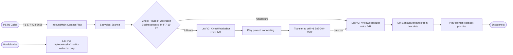

# terraform-aws-connect-callcenter

A free-tier-friendly Amazon Connect call center deployed via Terraform. Built incrementally so each layer can be verified in the AWS Console before the next is stacked.

**Live demo number**: `+1 877-424-6658` (toll-free) — call any time during M-F 7am–7pm ET to be transferred to my cell after a brief Lex-driven intake. After hours, the same **voice** Lex bot (`KylesWebsiteBot`) collects your name/phone/email/message and disconnects with a callback promise.

## Architecture


```

Reference: [`aws-ia/amazonconnect/aws ~> 0.0.1`](https://github.com/aws-ia/terraform-aws-amazonconnect).

## Live state

| Resource | Identifier |
|---|---|
| Connect instance | `kwade-callcenter-demo` (`6ea4190b-3cd7-43ee-90d6-559cb25059dd`) |
| CCP login | https://kwade-callcenter-demo.my.connect.aws/ccp-v2/ |
| Toll-free number | +1 877-424-6658 |
| Hours of Operation | `BusinessHours` — M-F 7am-7pm ET |
| Queue | `MainInboundQueue` |
| Routing Profile | `InboundVoiceRoutingProfile` (VOICE, concurrency 1) |
| Security Profile | `CallCenterAgent` |
| User | `agent1` / Kyle Hamwey |
| Lex bot (IVR / Connect) | `KylesWebsiteBot` (V2, alias `TestBotAlias`, ID `YPUBHWXZVM`) |
| Lex bot (portfolio web chat) | `KylesWebsiteChatBot` (V2; `terraform output lex_bot_id` for `REACT_APP_LEX_BOT_ID`) |
| Contact Flow | `InboundMain` (`9bbcd0b0-02d4-4c9a-88d1-c786a2348bca`) |
| Lex resource policy (Connect) | Attached to **KylesWebsiteBot** alias, scoped via `AWS:SourceArn` to this instance |
| Cognito web chat | Identity pool grants `lex:*` session APIs on **KylesWebsiteChatBot** alias only |

## What this repo demonstrates

For interview / portfolio context — this hits every line of most of the "AWS Connect" job descriptions:

- ✅ **Amazon Connect contact flows (IVR & chat)**: visual flow with branching on hours of operation, Lex slot collection, transfer to cell, voicemail-style data capture
- ✅ **Lex V2 integration**: (1) Connect invokes **`KylesWebsiteBot`** via alias resource policy scoped to this instance; (2) portfolio chat uses **`KylesWebsiteChatBot`** with Cognito unauth IAM on that bot alias only; contact flow JSON references the voice bot alias
- ✅ **Routing, queues, hours of operation**: declarative via Terraform, dependent resources resolved through the AWS-IA module's flatten pattern
- ✅ **Decoupled design (Connect → Lambda → APIs)**: the Lambda layer is the obvious next step; the bot's slot data lands as `Contact Attributes`, ready to be picked up by a `aws_connect_lambda_function_association` for backend dispatch (Slack notification, CRM upsert, calendar invite, etc.)
- ✅ **High availability / monitoring**: Connect is multi-AZ by default in us-east-1; `instance_contact_flow_logs_enabled = true` ships flow execution logs to CloudWatch Logs
- ✅ **Reusable contact flow patterns**: `flows/inbound_main.json` is checked in and content-hashed via `filebase64sha256`, so any drift between repo and live flow shows up in `terraform plan`

## Two providers, on purpose

This repo uses **both** `hashicorp/aws` and `hashicorp/awscc`:

- `hashicorp/aws` for everything except Lex V2 resource policies
- `hashicorp/awscc` for `awscc_lex_resource_policy` because the `aws` provider doesn't yet have an equivalent resource

Common pattern when AWS releases a new feature: the awscc provider auto-generates resources from CloudFormation specs and gets them earlier than the aws provider. Worth knowing.

## Repo layout

```
.
├── README.md              # this file
├── versions.tf            # terraform/provider version pins
├── providers.tf           # aws + awscc providers, default tags, identity data sources
├── variables.tf           # region, instance_alias, agent creds, lex bot config
├── main.tf                # connect module call + lex v2 resource policy
├── outputs.tf             # ccp url, console url, instance id/arn
├── terraform.tfvars.example
├── flows/
│   └── inbound_main.json  # exported from console, managed via filename + content_hash
└── .gitignore             # protects *.tfstate, terraform.tfvars
```

## How it was built (5 incremental applies)

| # | Step | Resources | Verified by |
|---|---|---|---|
| 1 | Bare instance | `aws_connect_instance` | CCP login URL loads |
| 2 | Queue + agent | hours, queue, routing profile, security profile, user | Log in as `agent1` to CCP |
| 3 | Lex V2 wiring | `awscc_lex_resource_policy` on bot alias | `aws lexv2-models describe-resource-policy` shows the statement |
| 4 | Contact flow | `aws_connect_contact_flow` (imported from console-built flow) | `terraform plan` shows zero drift |
| 5 | Phone number | claimed manually in Console | Inbound test call routes correctly |

## Account access

- **Day-to-day:** IAM Identity Center user `KyleHamwey`, AWS CLI profile `KyleHamwey`. Run `aws sso login --profile KyleHamwey` when the SSO session expires, then use `terraform` / `aws` with that profile (for example `export AWS_PROFILE=KyleHamwey` or `--profile KyleHamwey`).
- **Emergency:** IAM user `break-glass-admin` — console sign-in and password live in a password vault only. Use if Identity Center is unavailable; not for routine Terraform or daily work.
- **Root:** No root access keys. Root MFA enabled. Use the root login only for rare account-level actions AWS reserves for root.

## First-time setup (clean account)

```bash
# 1. AWS CLI authenticated (SSO: aws sso login --profile KyleHamwey); region us-east-1
aws sts get-caller-identity

# 2. Lex V2 bot exists in the same region/account
aws lexv2-models list-bots --region us-east-1

# 3. Configure
cp terraform.tfvars.example terraform.tfvars
$EDITOR terraform.tfvars   # set instance_alias (must be globally unique), agent_email/password, lex bot ARN

# 4. Init + apply incrementally per checkpoint
terraform init
terraform plan -out tfplan && terraform apply tfplan
```

## Cleanup gotchas

Connect API does not allow deletion of queues/hours/security profiles. If you `terraform destroy`:

```bash
# remove un-deletable resources from state first
terraform state rm \
  'module.amazon_connect.aws_connect_queue.this["MainInboundQueue"]' \
  'module.amazon_connect.aws_connect_hours_of_operation.this["BusinessHours"]' \
  'module.amazon_connect.aws_connect_security_profile.this["CallCenterAgent"]' \
  'module.amazon_connect.aws_connect_routing_profile.this["InboundVoiceRoutingProfile"]'

terraform destroy
```

The instance itself can be deleted, which cascades and removes everything inside it. Phone numbers must be released via Console before destroying.

## Roadmap

- [ ] **Lambda integration**: `aws_connect_lambda_function_association` + a Node.js handler that takes Lex slot data from Contact Attributes and posts to Slack / sends a SES email
- [ ] **Embed bot on portfolio site**: integrate `aws-lex-web-ui` into [`react-portfolio`](https://github.com/KHamwey/React-Portfolio) via a Cognito identity pool granting unauthenticated browsers `lex:RecognizeText` on the bot alias
- [ ] **CI/CD**: GitHub Actions workflow with `terraform plan` on PR, `apply` on merge to `main`, OIDC for AWS auth (no long-lived keys)
- [ ] **Remote state**: S3 + DynamoDB lock table — start with `terraform-state-bootstrap/` sub-module
- [ ] **Slot-driven branching**: route differently based on which intent matched (`ProvideResume` → SMS resume link via SNS; `WelcomeIntent` → straight to cell)
- [ ] **Contact Lens**: enable real-time transcription + sentiment, pipe into CloudWatch metrics

## License

MIT
